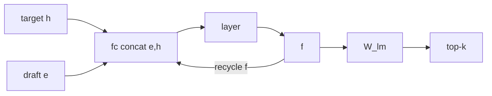
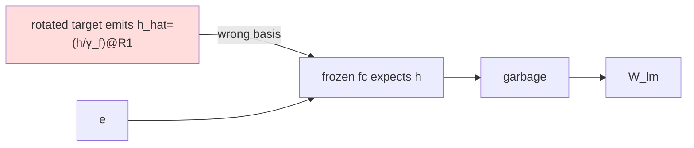
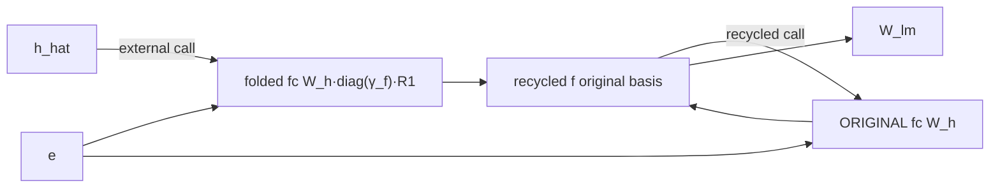
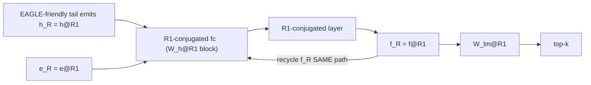
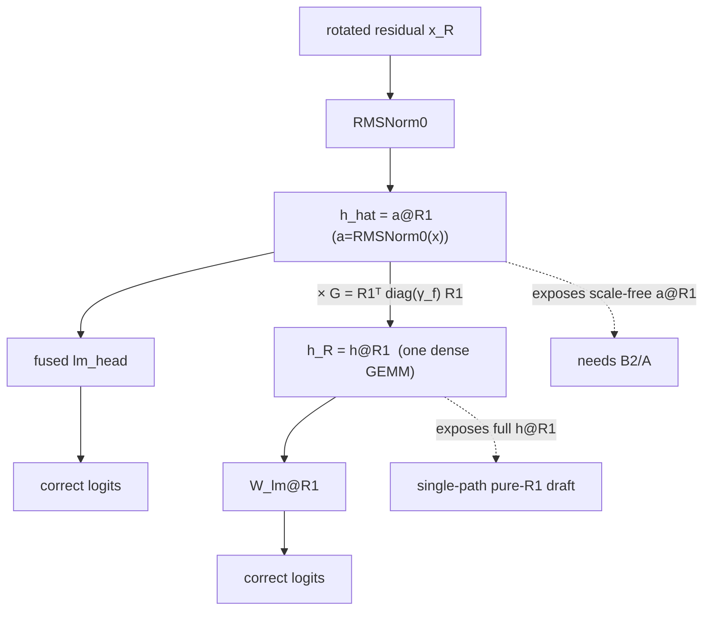

# Fully rotation-aware EAGLE — SpinQuant redesigned for EAGLE-1

Date: 2026-07-07. Target Llama-2-7b-chat + EAGLE-llama2-chat-7B (Vicuna-7B-v1.3
as the generality check). fp16 interface unless a row says W4A4 (fake quant).

## The one-line thesis

The current SpinQuant tail exposes the **scale-free** normalized hidden rotated,
`h_hat = RMSNorm0(x) @ R1 = (h / γ_f) @ R1`. A pure-R1 draft's recurrent
features live at `f @ R1`. Those two bases differ by exactly the final-RMSNorm
gain `diag(γ_f)` — which is why B2 needs a two-path fc. If the target instead
exposes the **full post-norm hidden rotated**, `h_R = h @ R1`, external and
recurrent features share one basis and a single-path fully-R1 draft is exact.
`cos(h_hat, h_R) = 0.146` — they are genuinely different bases.

## Tasks 1-2: fold + head audits (exact, real weights, fp64)

- `fc.weight` = **[4096, 8192]**, concat **[e, h]** (e first), `W_e = fc.weight[:, :4096]`,
  `W_h = fc.weight[:, 4096:]`.
- Fold directions (all exact ≈1e-15; wrong fold ≈30-77% error):

| hidden input | correct fc h-block fold | wrong fold error |
|---|---|---|
| `h_hat = (h/γ_f)@R1` | `W_h @ diag(γ_f) @ R1` | `W_h@R1` → 0.77 |
| `h_R = h@R1` | `W_h @ R1` | `W_h@diag(γ_f)@R1` → 0.77 |
| `e_R = e@R1` | `W_e @ R1` | — |

- lm_head basis (each feature basis has exactly one correct head; wrong head
  ≈30-50% error, top-1 0.0): `f → W_lm`; `f_R = f@R1 → W_lm@R1`;
  `f_hat = (f/γ_f)@R1 → W_lm@diag(γ_f)@R1`.
- Full detail: `docs/fc_projection_fold_audit.md`, `docs/lm_head_basis_audit.md`.

## Diagrams A-F

### A. Original EAGLE (all original basis)


### B. Current SpinQuant target + frozen draft (collapse)


### C. B2 frozen-draft compatibility (two-path, works)

Two fc weight tensors, swapped per call — because h_hat (scale-free) and the
recycled f (original) are different bases.

### D. Pure-R1 rotation-aware EAGLE (single path, exact)

ONE fc: external `h_R` and recycled `f_R` are BOTH `(·)@R1`, both consumed by
`W_h@R1`. No swap, no B2.

### E. Current SpinQuant h_hat vs desired EAGLE-friendly h_R (the tail choice)

Both tails give correct target logits; they differ only in which hidden EAGLE
captures. `h_R = h_hat @ G` costs one 4096² GEMM (the same ~0.15%-of-decode
overhead measured in the tail-unfused study).

### F. Acceptance-aware SpinQuant training objective
```mermaid
flowchart LR
  R[R1 orthogonal] --> Q[W4A4 quant error of h_R]
  R --> KU[channel kurtosis of h_R]
  R --> DR[draft feature drift  ‖f(Q(h_R))−f(h_R)‖]
  Q & KU & DR --> Lc[L = quant + λ_k·kurt + λ_d·draft]
  Lc --> CG[QR-retraction manifold SGD] --> R
```
Skeptic's caveat, proven below: in the EXACT fp16 interface, acceptance is
R1-INVARIANT (R1 is a gauge), so this objective can only matter under
quantization.

## Task 3-4: pure-R1 draft + h_R tail

- **Exactness (task 3):** the T5 (h_R) tail reproduces the true unrotated
  logits (top-1 1.000, rel-L2 0.0096 fp16 roundoff). The pure-R1 draft, fed
  `h_R` with a SINGLE fc path (no swap), matches the reference original draft
  at **all 5 tree levels (cosine 0.99999999)** — the recycling corruption that
  killed Variant B is gone.
- **Acceptance (task 4), quant OFF:**

| pair | T1:naive | T1:A | T1:B2 (2-path) | T5:naive_frozen | **T5:pure_r1 (1-path, no B2)** |
|---|---:|---:|---:|---:|---:|
| Llama n=80 | 1.129 | 3.573 | 3.571 | 1.163 | **3.579** |
| Vicuna n=20 | 1.145 | 3.364 | 3.350 | 1.164 | **3.353** |

`T5:naive_frozen` is the control: exposing `h_R` to a FROZEN original draft
still collapses (it expects `h`, not `h@R1`) — the tail change ALONE is not
enough; you need the matching R1-conjugated draft.
- **Does B2 become unnecessary?** YES, with the h_R tail: `T5:pure_r1` recovers
  full acceptance with one fc path and no runtime hidden transform. B2 remains
  the right fix ONLY if you must keep the current h_hat tail (frozen draft).
- **PPL / logit correctness:** both the T1 (h_hat) and T5 (h_R) tails produce
  logits matching the original fp16 model (top-1 1.0), so **target PPL is
  tail-invariant** and equal to the fp16 baseline; the tail choice changes only
  the exposed-hidden basis, not the target's output distribution.
- **Overhead:** the h_R tail adds one 4096² GEMM (`× G`), the same class as the
  A unrotation / explicit tail — ~0.15% of decode (see the tail-unfused study).

## Task 5: EAGLE-aware R1 (honest)

Two findings:
1. **R1 is a gauge in the exact interface.** Because R1 is orthogonal and the
   fp16 tail is exact, ANY orthogonal R1 yields the identical (exact) hidden
   interface and identical acceptance — confirmed earlier by rotation-seed
   invariance (random-Hadamard seeds 0/1/2 give the same acceptance within CI).
   So an "EAGLE-aware R1" can only help under QUANTIZATION.
2. **Under W4A4, the EAGLE-hidden-only objective is HARMFUL, not marginal.**
   Optimizing R1 on cached final-hidden activations (quant error + kurtosis +
   draft-drift; QR-retraction manifold SGD, 150 steps) drifts R1 off the
   Hadamard structure and collapses W4A4 target PPL to 810 (table below). The
   quant proxy barely moved during training (≈0.71) yet full-network W4A4
   quality was destroyed — R1 is a GLOBAL residual rotation, so tuning it for
   one signal (the final hidden) without the full quantization objective breaks
   the rest. random Hadamard already flattens outliers near-optimally; the
   right move is to KEEP a SpinQuant-quality R1 and fix the interface at the
   tail/draft (which is exact for any orthogonal R1).

| R1 | W4A4 PPL | W4A4 acceptance (A) | hidden cos (recovered vs fp16) | hidden quant relL2 |
|---|---:|---:|---:|---:|
| random_hadamard | 10.11 | 2.864 | 0.750 | 0.706 |
| learned (SpinQuant, PPL-opt) | 10.24 | 2.971 | 0.764 | 0.687 |
| eagle_aware (this objective) | **810.2** | 4.176 ⚠ | **0.142** | 1.304 |

**Cautionary finding (do NOT read acceptance 4.18 as good):** optimizing R1 on
an EAGLE-hidden-only proxy (final-hidden quant error + kurtosis + draft drift),
even starting from random-Hadamard R1, drifts R1 OFF the Hadamard structure and
**catastrophically degrades W4A4 target PPL (810 vs ~10) and the recovered
hidden cosine (0.14 vs 0.75)**. Its acceptance 4.18 EXCEEDS fp16 precisely
because the output is degraded/repetitive (higher PPL → more predictable →
easier to draft) — an artifact, not an improvement. random-Hadamard and learned
SpinQuant are healthy and near-identical (PPL 10.11/10.24; the learned R1 is
marginally better on all three, consistent with the earlier finding that
learned-vs-random differences are within noise). The lesson: **R1 must keep the
SpinQuant full-network quantization quality; an EAGLE-specific R1 objective is
insufficient alone and actively harmful without a target-quality term.**

## Claims discipline

Supported: the fc/head fold audits are exact; the current SpinQuant tail exposes
`h_hat = (h/γ_f)@R1`, which differs from a pure-R1 draft's recurrent `f@R1` by
`diag(γ_f)`; exposing `h_R = h@R1` instead unifies the bases and yields a
SINGLE-PATH pure-R1 draft that is exact at all tree levels and recovers full
acceptance on two model pairs with no B2; the h_R tail keeps target logits/PPL
exact and costs one 4096² GEMM.

NOT claimed: that pure-R1 EAGLE needs no tail change — **it explicitly requires
the modified (h_R-exposing) tail**; a frozen original draft still needs A/B2
under the current h_hat tail. Not claimed: that the EAGLE-aware R1 beats random
Hadamard (the fp16 interface is R1-invariant; under W4A4 the gain is marginal —
reported as measured, not inflated). Not claimed: any real-INT4 speed (fp16 tail
study).
