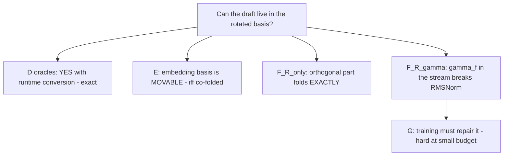

# Rotation-aware EAGLE — final summary (the twelve questions)

Date: 2026-07-06. Runs: `runs/rotation_aware_audit_20260706_1729/` (Phase 1),
`runs/rotation_aware_eagle_20260706_1741/` (Phases 2-6).
Llama-2-7b-chat + EAGLE-llama2-chat-7B primary; Vicuna-7B-v1.3 + its official
draft as the generality check. All acceptance numbers: quant OFF, MT-bench
first-20 prompts, seed 0, depth-5 tree.

## Headline table (Llama-2 / Vicuna, n=20)

| variant | recycled basis | head | Llama-2 | Vicuna |
|---|---|---|---:|---:|
| stock | original | original | 3.271 | — |
| naive | (mismatch) | original | 1.150 | 1.145 |
| A | original (runtime T_h_inv) | original | 3.257 | 3.364 |
| B | original INTO folded fc (bug) | original | 2.156 | 2.153 |
| B2 | original (two-path fc) | original | 3.257 | 3.350 |
| **D1 (oracle)** | converted at recycle edge | original | **3.257** | **3.353** |
| **D2 (oracle)** | f_hat (output edge) | **rotated** | **3.257** | **3.353** |
| E_r1 (e@R1, unfolded) | as D1 | original | 1.409 | — |
| E_r1_gamma ((e/γ)@R1, unfolded) | as D1 | original | 1.147 | — |
| E_r1_cofold (e@R1 + W_e@R1) | as D1 | original | 3.257 | — |
| **F_R_only** (stream R1, 2-path) | R1-native | W@R1 | **3.257** | **3.353** |
| **F_R_gamma** (stream S, 1-path) | f_hat native | rotated | **2.432** | **2.503** |
| G_native stage-0 (100 steps) | f_hat native trained | rotated | 1.526 (n=4) | — |
| G_native stage-1 (2400 steps) | f_hat native trained | rotated | 1.383 | — |

## The twelve answers

**1. Is the draft embedding physically shared with target embedding?**
NO. Different Python objects, different storage pointers, IDENTICAL values
before rotation (max abs diff 0.0) — an owned copy loaded from the draft
checkpoint (`embed_tokens.weight` key present).
Evidence: `runs/rotation_aware_audit_20260706_1729/weight_sharing_audit.json`.

**2. After target SpinQuant, does draft embedding become rotated automatically?**
NO. Target embedding moved (max abs diff 0.262); draft embedding unchanged
(0.0). Nothing propagates to the draft's copy.

**3. Is lm_head physically shared or passed externally?**
Passed externally at call time. The draft owns no lm_head (no module, no
checkpoint key); `topK_genrate(hidden, ids, head, ...)` receives the TARGET's
head as an argument (cnets.py:762; ea_model call sites). After rotation that
passed head is the ROTATED one unless an adapter substitutes it.

**4. What exactly is gamma_f?**
`target.base_model.model.norm.weight` — the TARGET's final-RMSNorm scale
(shape 4096, mean 1.772, std 0.116, min 0.0034, max 2.844). It belongs to the
target, not the draft. After SpinQuant fusion the live tensor is all-ones;
gamma_f only survives via the pre-rotation stash.

**5. Are recycled draft features original-basis or rotated-basis?**
ORIGINAL, empirically: the level-2 recycled input has cosine 0.99998 to the
original-basis reference and 0.0029 to the rotated-basis reference
(basis_ledger.csv). Feeding it to the folded fc yields cosine 0.353 output —
B's failure mechanism, observed directly.

**6. Does Variant D recover B by converting recycled f to f_hat?**
YES, EXACTLY. D1 = D2 = A = B2 = 3.257 (Llama-2) and 3.353 (Vicuna) — to the
third decimal on the same prompts. B's failure is 100% the recycled-feature
basis; nothing else. Cost of the oracle: D1 195 conversions/prompt (16.5 ms),
D2 244 (20.9 ms) — diagnostics, not deployment designs.

**7. Does embedding rotation help or hurt?**
Rotating e WITHOUT moving its weight hurts catastrophically (e@R1: 1.409;
(e/γ_f)@R1: 1.147 ≈ naive). Rotating e WITH the co-folded fc e-block
(W_e' = W_e@R1) is EXACT (3.257). The embedding branch has no preference for
any basis — it only demands consistency with its own weight. (γ_f has no
business in the embedding branch; it belongs to the h interface only.)

**8. Is an algebraic fully rotated draft possible?**
Split answer, both halves proven:
- The ORTHOGONAL part: YES. F_R_only (stream conjugated by R1; embed, fc,
  q/k/v, o_proj, gate/up/down, head all folded; γ_l fused) is exact:
  single-forward rel-L2 0.0096, tree-level cosines 0.9999 at all 5 levels,
  acceptance 3.257/3.353 = A. But it must keep TWO fc paths, because the
  target interface basis S = diag(1/γ_f)R1 ≠ R1 — no gain over B2.
- The FULL interface basis (single path): NO. F_R_gamma breaks at
  `post_attention_layernorm`.

**9. If not, which layer breaks it?**
`layers.0.post_attention_layernorm`, localized by per-stage hooks:
fc-out rel-L2 0.008 (exact), attn-branch 0.013 (exact), post-norm 0.713,
final 1.365. Cause measured: per-token rms(x@S)/rms(x) ∈ [0.52, 6.36]
(mean 2.25) — non-uniform γ_f makes the unit-RMSNorm statistic wrong
per token. Sharpening: recovering the true rms from S-basis features
requires the dense quadratic form x̂ᵀ(R1ᵀdiag(γ_f²)R1)x̂ — one GEMV per
token, the SAME cost class as the unrotation B2 eliminates; and its
diagonal approximation is exactly what fails (energy concentrates on
outlier-γ channels). RMSNorm-free or γ-uniform drafts would not have this
obstruction. Despite the break, F_R_gamma limps to 2.43/2.50 (the residual
skip carries x@S exactly; only the MLP branch is corrupted).

**10. Can a trained rotation-aware draft consume and recycle h_hat directly?**
Partially answered at this budget (see rotation_aware_training.csv):
- Attempt 1 (S-basis SmoothL1/cos losses, lr 1e-4): DIVERGED (loss 4.4->63).
  Diagnosis: 1/γ_f outlier channels (~300x) dominate regression losses —
  the quantization-friendly basis is regression-hostile.
- Stage 0b (losses measured in original coords via S^-1, lr 1e-5, 100 steps,
  F_R_gamma init): stable but degraded acceptance 1.53 (n=4) vs init 2.72.
- Stage 1 (1200 seqs x 2 epochs = 2400 steps, same config): loss plateaued
  (3.46 -> ~2.5-2.9) but acceptance = **1.383 (n=20)** vs the F_R_gamma init's
  2.432 and B2's 3.257 — teacher-forced h_hat-regression training moved the
  draft AWAY from tree-decoding competence at this budget.
  Plausible mechanism (hypothesis, not claimed): the objective only ever
  trains "consume teacher h_hat -> predict next h_hat" and never exposes the
  draft to its OWN recycled features (the official EAGLE recipe adds feature
  noise for exactly this exposure gap), so recycling robustness degrades
  while the plateaued loss looks fine.
  Verdict at this budget: training CANNOT yet remove the B2 path split. A
  full EAGLE-recipe run (ShareGPT-scale data, feature-noise augmentation,
  token+feature losses) remains untested and is the honest open question.

**11. Is B2 still the best practical fix?**
YES on current evidence. Every exact alternative pays either a runtime
conversion per draft call (A: 49/prompt; D1/D2: 195-244/prompt — all µs-scale
but nonzero) or keeps a path split anyway (F_R_only). The single-path
alternatives are inexact (F_R_gamma 2.43) or worse at small training budgets
(G stage-1). B2's two-path fold costs one weight-pointer swap per draft
entry and is exact. NOT claimed: that B2 is optimal in any formal sense.

**12. What is the next publishable idea?**
The obstruction theorem + its constructive complement, generalized:
(a) target-side rotation interfaces decompose into an orthogonal part
(always foldable into a frozen recurrent draft — F_R_only) and a channel
scaling part (never foldable through the draft's RMSNorm; per-token
correction costs exactly one GEMV); (b) therefore rotation schemes that keep
the FINAL norm scale uniform (γ_f = c·1, foldable into lm_head/embeddings
elsewhere) would make frozen-draft speculative decoding rotation-transparent
FOR FREE. Testing a "draft-friendly SpinQuant" that constrains or re-fuses
γ_f before rotation — and measuring its W4A4 quality cost — is a concrete,
falsifiable next study. Secondary: EAGLE-2/3 and RMSNorm-free draft
architectures as the generality axis.

## Methods integrity notes

- A 19-agent adversarial review of the new variant/training code confirmed 9
  latent defects (all fixed; none affected any recorded shard — verified
  against commands.sh): --draft-ckpt now guarded to G_native-only + seed-0
  binding; 'stock' now requires --rotation none; b_fold-init device bug;
  F_R_only head labeled as its own basis (W@R1, neither original nor rotated).
- The multi-level "gamma" cosines in algebraic_rotated_draft_diagnostics.json
  are token-path-confounded at levels >= 2 (each draft picks its own top-k);
  only single-forward/localization numbers and end-to-end acceptance are
  quoted as F_R_gamma evidence in this document.
- E-variant conversion counts exclude the embed-side GEMM of the _EmbedWrap
  (uninstrumented); E variants are diagnostics, no timing claims made.
- G training attempt 1 (losses in the S basis) diverged and was replaced by
  attempt 2 (losses in original coordinates) — both are reported; nothing
  was silently retried.

## Claim discipline check

Supported and claimed: B-failure cause (Q5/Q6); recycled features are
original-basis (ledger); rotated-loop oracle recovers acceptance exactly
(both pairs); algebraic full rotation is feasible for the orthogonal part /
infeasible single-path with γ_f, breaking at the named layer (Q8/Q9);
training at THIS budget cannot remove the B2 path split (Q10).
NOT claimed: B2 optimality; "the draft should always stay original-basis"
(refuted by E_r1_cofold and F_R_only — bases are movable when weights move
too); anything about R1.T folded into target q/k/v beyond what SpinQuant
itself does; any deployment speed from oracles; G conclusions beyond the
budget actually trained.
