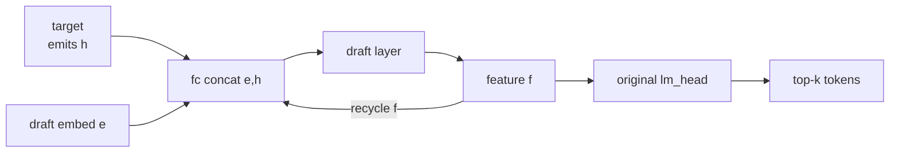
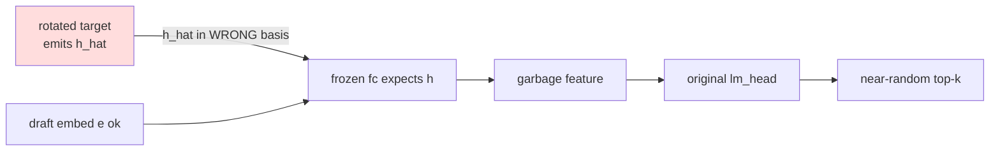
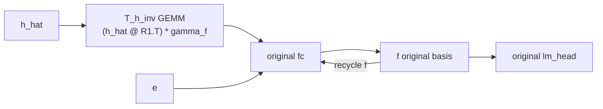
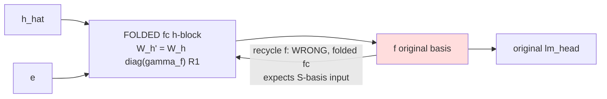
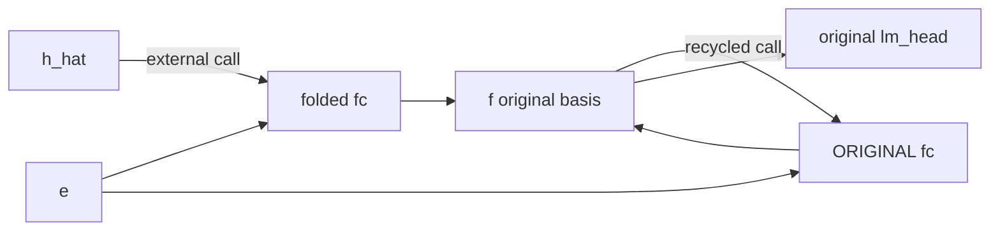
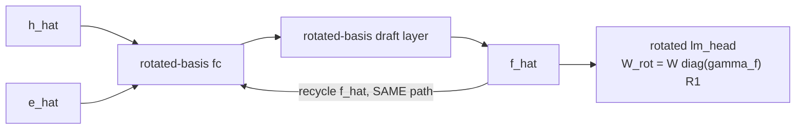

# Rotation-aware EAGLE: basis-level overview (pre-implementation audit)

Date: 2026-07-06. Mandatory reading before any Variant D/E/F/G code.
Question: can target hidden, draft embedding, draft recurrent features, and
lm_head scoring all live in ONE consistent rotated basis, removing B2's
two-path split?

## 0. Notation (used verbatim in code and CSVs)

| symbol | meaning |
|---|---|
| `h` | original target hidden, post-final-RMSNorm, INCLUDES gamma_f |
| `gamma_f` | `target.model.norm.weight` (the target's final RMSNorm scale; measured in the weight-sharing audit — never assumed) |
| `R1` | residual-stream rotation (4096x4096, orthogonal) |
| `h_hat` | rotated target hidden: `h_hat = (h / gamma_f) @ R1` |
| `e` | draft token embedding, original basis (draft's OWN frozen copy) |
| `e_hat` | draft embedding moved to rotated basis (if used) |
| `f` | draft recycled feature, original basis |
| `f_hat` | draft feature in rotated-target basis: `f_hat = T_h(f)` |
| `T_h(x)` | `(x / gamma_f) @ R1`  — as a matrix: `S = diag(1/gamma_f) @ R1`, `T_h(x) = x @ S` |
| `T_h_inv(x)` | `(x @ R1.T) * gamma_f` — `S_inv = R1.T @ diag(gamma_f)` |

Key algebra used everywhere below (row-vector convention, `L(x) = x @ W.T + b`):

- **input-fold** (make L consume `x_hat = x @ S`): `W' = W @ (S_inv).T = W @ diag(gamma_f) @ R1`.
  For the fc hidden block this is EXACTLY the existing Variant-B fold.
- **output-fold** (make L emit `y_hat = y @ S`): `W'' = S.T @ W = R1.T @ diag(1/gamma_f) @ W`, `b'' = b @ S`.
- `S` is NOT orthogonal (gamma_f is channel-wise); `R1` alone is.

## 1. Draft architecture facts (from cnets.py, verified line numbers)

- `Model.forward(hidden_states, input_ids, ...)`: `e = embed_tokens(ids)`;
  `x = fc(cat([e, h], dim=-1))` (cnets.py:592-593; **e first, h second**);
  ONE `LlamaDecoderLayer(index=0)`; return feature (no final norm).
- Layer index 0 has **NO input_layernorm** (cnets.py:440-441: `if self.index != 0`).
  The only interior norm is `post_attention_layernorm` (RMSNorm, cnets.py:432).
- Non-linearities and their basis exposure:
  - RoPE / softmax: head-space, residual-basis-free.
  - SiLU gate: operates on `gate_proj` OUTPUT (not residual basis) — basis-free.
  - **RMSNorm: divides by rms(x) of the RESIDUAL vector — invariant under
    orthogonal maps and under uniform scaling, NOT under channel-wise
    `diag(1/gamma_f)`.** This is the single algebraic obstruction candidate.
- `topK_genrate` (cnets.py:762-): first `self(hidden_states=EXTERNAL, ...)`,
  then per level `hidden_states = out_hidden` (raw forward output) is recycled
  into the SAME forward; `head(out_hidden)` scores raw draft features.
- Draft keeps its own KV cache (`stable_kv`); KV entries are post-fc internals,
  so edge-of-model basis conversions do not touch them.

## 2. Diagrams

### 2.1 Original EAGLE (everything original basis)

### 2.2 Target-only SpinQuant + frozen draft (the failure)

### 2.3 Variant A (runtime unrotation)

### 2.4 Variant B (first-layer fold — recycling breaks)

### 2.5 Variant B2 (two-path fold — works, but path split)

### 2.6 Proposed fully rotation-aware EAGLE (target design)

## 3. Basis ledger table (expected; verified empirically by run_basis_ledger.py)

| tensor | producer | expected basis | consumed by | consumer expects |
|---|---|---|---|---|
| h | original target | original | (reference only) | — |
| h_hat | rotated target | S = T_h(original) | draft fc h-block | original (frozen) / S (folded) |
| e | draft embed_tokens (own copy) | original | fc e-block | original |
| f (level-1 out) | draft layer | original | head + recycle | original |
| recycled f (levels 2+) | draft | original | fc h-block | whatever the fold says — THIS is B's bug |
| original lm_head W | stash (pre-rotation clone) | original-in | f | consistent |
| rotated lm_head W_rot | fused model / `W diag(gamma_f) R1` | S-in | f_hat | consistent |

## 4. The algebraic core: what CAN and CANNOT be folded

For a fully rotated draft the recycled feature must live in the SAME basis the
fc hidden block consumes, and that basis is pinned by the target interface: `S`.

- Every LINEAR edge (fc blocks, q/k/v inputs, o_proj output, gate/up inputs,
  down_proj output, embedding rows, head) can be folded with `S` or `R1`
  exactly — including the channel-wise `gamma_f` part (it is linear).
- Residual ADDS are basis-transparent (same transform both branches).
- **RMSNorm is the obstruction**: with the stream in basis `S`,
  `RMSNorm_unit(x @ S) != RMSNorm_unit(x) @ S` because
  `rms(x @ S) != rms(x)` when `gamma_f` is non-uniform.
  With the stream in basis `R1` (orthogonal), after fusing the layer's own
  `gamma_l` into gate/up, `RMSNorm_unit(x @ R1) == RMSNorm_unit(x) @ R1`
  EXACTLY (norm-preserving), and even a UNIFORM scale would cancel
  (RMSNorm is scale-invariant). So the obstruction is precisely the
  NON-UNIFORMITY of gamma_f.
- But an `R1`-basis stream cannot consume `h_hat` and recycle its own output
  through ONE fc fold: external basis is `S`, internal would be `R1`, and
  `S != R1` by exactly `diag(1/gamma_f)` — which is dense in the R1 basis.
  Hence:

| design | fc paths | interior RMSNorm | expected outcome |
|---|---|---|---|
| F_R_gamma: stream basis S | ONE (unified) | inexact (gamma_f in rms) | approximate; error enters ONLY via mlp branch (skip connection carries x@S exactly) |
| F_R_only: stream basis R1 | TWO (external S-in, recycled R1-in) | exact | exact but reintroduces the path split — no gain over B2 |

## 5. Variant map for this study

| variant | fc fold | recycled feature on the wire | embedding | head | runtime ops added |
|---|---|---|---|---|---|
| D1 (oracle) | folded (B-style) always | f (converted to S-basis at the recycled INPUT edge, `T_h`) | e original | original | 1 GEMM + 1 elementwise per recycled call |
| D2 (oracle) | folded always | f_hat (converted at OUTPUT edge) | e original | ROTATED (`W diag(gamma_f) R1`) | same count, other edge |
| E-ablations | folded (D1 loop) | as D1 | e / `e@R1` / `(e/gamma_f)@R1` / `e@R1`+co-folded W_e | original | embed transform |
| F_R_gamma | all-fold, stream S | f_hat natively | `e@S` (co-folded) | rotated | ZERO |
| F_R_only | two-path fold, stream R1 | `f@R1` natively | `e@R1` (co-folded) | `W@R1` | ZERO (but split) |
| G (training) | F_R_gamma init | f_hat natively | co-folded | rotated | ZERO; training repairs RMSNorm error |

D1 and D2 are algebraically equivalent to A (exact modulo fp roundoff of the
conversions); they are ORACLES that prove/refute the recycled-basis explanation,
not deployment designs.

## 6. Falsifiable predictions (scored in the final summary)

1. D1 and D2 both recover A/B2 acceptance (recycled-basis mismatch is the
   whole story of B's failure).
2. `e@R1` and `(e/gamma_f)@R1` WITHOUT co-folding W_e collapse acceptance
   (embedding branch has its own basis contract); with co-folded W_e, `e@R1`
   is exact (embedding basis is movable, it just must move WITH its weight).
3. F_R_only single-forward + level-wise EXACT (validates conjugation
   machinery; isolates gamma_f as the sole obstruction).
4. F_R_gamma inexact with the error entering at post_attention_layernorm;
   end-to-end damage depends on gamma_f dispersion (measured in audit).
5. If (4) is mild, G training from F_R_gamma init can close the gap,
   yielding a single-path rotation-native draft.
