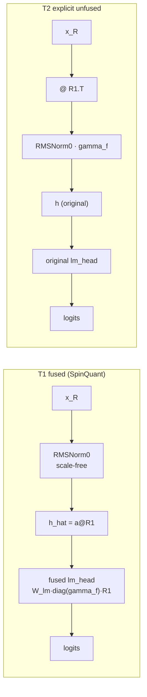
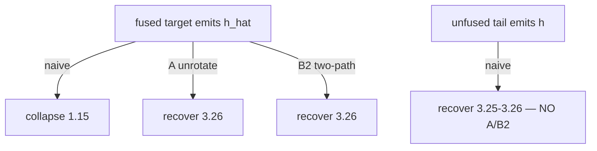

# Explicit unfused tail vs SpinQuant fused tail — overhead study

Date: 2026-07-07. Run dir: `runs/tail_unfused_20260707_2051/`.
Runtime-overhead study, fp16, batch=1, single RTX 4090, quant OFF. Everything
below is measured; no quantized-serving or multi-batch claim is made.

## 1. What exactly is being unfused?

SpinQuant folds THREE things into one fused lm_head so the residual stream can
stay in the rotated basis end-to-end:

The fused path emits `h_hat` (rotated basis) as the hidden EAGLE captures — so
a frozen draft breaks and needs A (runtime unrotation) or B2 (two-path fold).
The unfused path runs `R1.T` + the original final RMSNorm explicitly, so
`model.norm` emits the true original `h` and the frozen draft just works.

## 2. Where is gamma_f applied in each tail mode?

| mode | R1.T | final norm | gamma_f applied | lm_head | emitted hidden |
|---|---|---|---|---|---|
| T0 original | — | RMSNorm0 | on `a` (original) | original | `h` |
| T1 fused | folded in head | RMSNorm0 (scale-free) | folded into head | fused | `h_hat = a@R1` |
| T2 unfused-correct | on x_R (pre-norm) | RMSNorm0 | on `a` (after unrotate) | original | `h` |
| T3 unfused-postnorm | on a_R (post-norm) | RMSNorm0 in rotated space | on `a` (after unrotate) | original | `h` |
| T4 wrong-order | — | RMSNorm0 (rotated) | on `a@R1` (rotated!) | original | `(a@R1)·gamma_f` ✗ |

`a := RMSNorm0(x)` (scale-free). T4 is wrong because `diag(gamma_f)` and `R1`
do not commute (measured gamma_f std = 0.116, far from uniform).

## 3-7. Correctness + interface (Llama-2-7b-chat + EAGLE, n=20)

| # question | answer |
|---|---|
| 3. Does T2 match original logits? | YES — fp16 top-1 1.000, hidden cosine 0.99996, logit rel-L2 0.0092 (roundoff); fp32 exact (rel-L2 0.0, cosine 1.0). |
| 4. Does T3 match T2? | YES — identical hidden (cosine 0.99996), acceptance 3.257 vs 3.252. |
| 5. Does T4 fail as expected? | YES — fp32 hidden cosine −0.014, top-1 0.0; fp16 cosine 0.004; e2e acceptance collapses to 1.007. |
| 6. Does the unfused tail expose EAGLE-compatible h? | YES — `model.norm` emits original-basis `h`; T1 emits rotated `h_hat` (cosine 0.003 to h). |
| 7. Does naive EAGLE recover without A/B2 under T2/T3? | YES — T2:naive 3.252, T3:naive 3.257 vs T1:A 3.257 / T1:B2 3.257; T1:naive collapses to 1.150. |

## 8. Tail-only overhead (microbench, fp16)

The tail is dominated by the lm_head weight read (262 MB). R1.T adds one
33 MB matrix read:

| M | fused tail T1 (us) | explicit tail T2 (us) | added R1.T | % of tail |
|---|---:|---:|---:|---:|
| 1 | 326.7 | 364.5 | +37.9 | +11.6% |
| 26 | 355.3 | 379.9 | +24.6 | +6.9% |
| 64 | 395.3 | 421.9 | +26.6 | +6.7% |
| 256 | 513.0 | 544.8 | +31.7 | +6.2% |

So the R1.T is ~4–12% of the *tail*, but the tail is a small slice of a full
7B forward (which reads ~13 GB of layer weights).

## 9. End-to-end overhead

Llama-2-7b-chat (n=80) — the decision table:

| condition | accept | tokens/s | R1.T ms/prompt | hidden exposed |
|---|---:|---:|---:|---|
| T0:stock (unrotated ref) | 3.578 | 123.06 | 0 | original h |
| T1:A (fused + unrotate) | 3.573 | 122.04 | 0 | rotated→unrotated |
| T1:B2 (fused + two-path) | 3.571 | 125.67 | 0 | rotated→folded |
| **T2:naive (unfused)** | **3.568** | **121.54** | 1.89 | original h |
| **T3:naive (unfused)** | **3.569** | **125.16** | 1.91 | original h |
| T1:naive (broken) | 1.129 | 40.68 | 0 | rotated h_hat ✗ |
| T4:naive (wrong order) | 1.019 | 36.91 | 0 | wrong ✗ |

Vicuna-7B-v1.3 (n=20) reproduces it: T1:A 3.364@113.96, T1:B2 3.350@110.99,
**T2:naive 3.364@116.72, T3:naive 3.350@115.16**, T1:naive 1.145, T4:naive 1.002.

Two overhead readings:
- **Direct (noise-free): R1.T = 1.9 ms/prompt = 0.15% of the ~1.3 s decode.**
  This is the honest cost of the added op.
- tok/s-delta vs the best fused recover variant: T3 = −0.4%, T2 = −3.3% (Llama
  n=80). These deltas are DOMINATED by run-to-run thermal/scheduling noise:
  B2 alone measured 110-126 tok/s across runs, and on Vicuna T2/T3 came out
  FASTER than A/B2. There is no reliable throughput ordering among the four
  correct variants (T1:A, T1:B2, T2, T3) — they are all ~120-126 tok/s.

Either reading is well under the 3% bar. The explicit tail is not measurably
more expensive than A/B2 at batch=1.

## 10. Is the overhead smaller than the A/B2 complexity justifies?

Yes. The explicit tail is ~15 lines (one `R1.T` GEMM + the original RMSNorm +
the original lm_head), needs no draft-side adapter, no two-path fc bookkeeping,
no recycled-feature basis reasoning — and measures at or below A/B2 throughput.

## 11. Should we stop trying to fold the final lm_head for EAGLE?

For **fp16 EAGLE compatibility**: yes — final-lm_head fusion buys no measurable
speed here and costs the whole A/B2/B-recycling headache. Run the tail explicitly.
IMPORTANT NON-CLAIM: this does NOT say fusion is pointless for QUANTIZATION.
This study runs the tail in fp16. In a truly quantized deployment the fused
lm_head lets the residual stay in the rotated basis for the quantized matmuls;
un-fusing reintroduces an fp16 `R1.T` and an fp16 lm_head. The recommendation is
scoped to *EAGLE interface compatibility*, not to the quantized forward.

## 12. Next engineering step

- Re-measure under a REAL quantized target (the QuaRot/tinygemm path from the
  real-INT4 study) to see whether the fp16 `R1.T` + fp16 lm_head tail erodes the
  quantization speedup — that is the only place fusion might still pay.
- A tiny fused `R1.T→RMSNorm→lm_head` CUDA/Triton kernel if even the 0.15% (or
  the quantized-case cost) ever matters.

## Decision

Direct R1.T overhead = 0.15% of decode; tok/s-delta vs fused recover variants
is within noise (< 3% either way, sometimes negative) AND acceptance matches
A/B2 on both pairs → **Use the explicit unfused tail instead of complex
final-lm_head fusion for EAGLE compatibility** (fp16 setting). Keep A/B2 only
where the tail must stay fused for the quantized matmul path — to be tested
(step 12).

## Methods integrity

A 6-agent adversarial review confirmed 3 defects, all in the timing *breakdown*
only (every verifier agreed the headline `total_ms`-based decision is
unaffected): the overhead figure stacked R1.T on top of `target_ms` when R1.T
already runs inside it (fixed: R1.T is now carved out of the target bar); the
gamma multiply was timed inside the RMSNorm bracket for T2 but outside for
T3/T4 (fixed for future runs; a negligible elementwise op); and the tail
lm_head timer would fold in draft-head GEMMs for a hypothetical rotated `stock`
condition that none of the 7 measured conditions use (now asserted against).
The recorded acceptance and `total_ms`/tok/s numbers are unaffected.

## H1–H7 verdicts

| H | claim | verdict |
|---|---|---|
| H1 | T2 matches original fp16 logits | PASS (top-1 1.0, cos 0.99996) |
| H2 | T3 matches T2 | PASS (identical hidden) |
| H3 | T4 wrong-order fails | PASS (cos 0.004, acc 1.02) |
| H4 | T2/T3 expose EAGLE-compatible h → naive no longer collapses | PASS (3.57 vs T1:naive 1.13) |
| H5 | explicit-tail overhead small at batch=1 | PASS (direct 0.15%; tok/s within noise) |
| H6 | if small, final-lm_head fusion unnecessary for EAGLE compat | PASS (fp16 scope) |
| H7 | if large, B2 stays useful | N/A — overhead is not large here |
